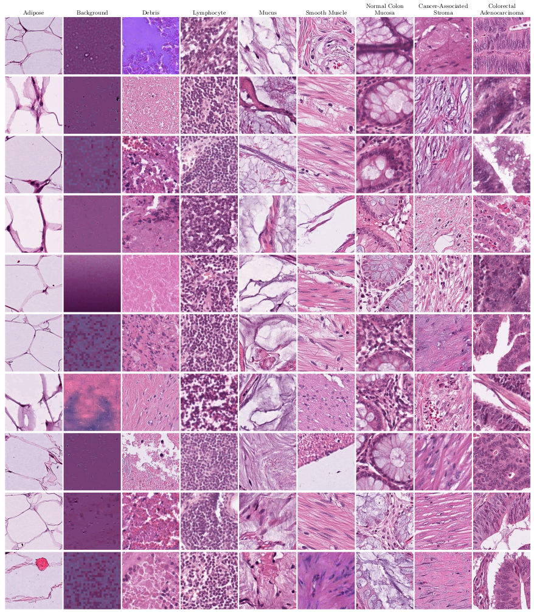

# NCT-CRC-HE-experiments

### 1. Overview (abstract) [[arxiv preprint](https://www.arxiv.org/abs/2409.11546)]

Numerous deep learning-based solutions have been proposed for histopathological image analysis over the past years. While they usually demonstrate exceptionally high accuracy, one key question is whether their precision might be affected by low-level image properties not related to histopathology but caused by microscopy image handling and pre-processing. In this paper, we analyze a popular NCT-CRC-HE-100K colorectal cancer dataset used in numerous prior works and show that both this dataset and the obtained results may be affected by data-specific biases. The most prominent revealed dataset issues are inappropriate color normalization, severe JPEG artifacts inconsistent between different classes, and completely corrupted tissue samples resulting from incorrect image dynamic range handling. We show that even the simplest model using only 3 features per image (red, green and blue color intensities) can demonstrate over 50% accuracy on this 9-class dataset, while using color histogram not explicitly capturing cell morphology features yields over 82% accuracy. Moreover, we show that a basic EfficientNet-B0 ImageNet pretrained model can achieve over 97.7% accuracy on this dataset, outperforming all previously proposed solutions developed for this task, including dedicated foundation histopathological models and large cell morphology-aware neural networks. The NCT-CRC-HE dataset is publicly available and can be freely used to replicate the presented results. 

This repository provides the implementation of the EfficientNet-based solution originally presented in [[this paper (arxiv preprint)](https://www.arxiv.org/abs/2409.11546)] and the dataset analysis tools. 



Visualization of normalized H&E stained image patches from the NCT-CRC-HE-100K dataset. The images were sampled randomly for each of 9 tissue classes.


### 2. Jupyter notebooks

Please, check `notebooks/` directory to find the dataset analysis scripts / notebooks. 


### 3. Prerequisites

- Python: torch, timm, scipy, numpy, opencv packages
- NVidia GPU


### 4. Data

1. Download the [CRC-VAL-HE-7K](https://zenodo.org/records/1214456) dataset and extract it to the ``data`` directory.
2. (the same page) Download the [NCT-CRC-HE-100K](https://zenodo.org/records/1214456) dataset and extract it to the ``data`` directory.


### 5. Training

Use `scripts/train_model.py` to train EfficientNet-B0 (avg) model. To train EfficientNet-B0 (max) model, change `GLOBAL_POOL` to `max`, in the `scripts/train_model.py`.

Pretrained weights will be available at `releases` page.


### 6. Results

| Model                                              | Accuracy | 
|----------------------------------------------------|----------|
| [DeepCMorph](https://github.com/aiff22/DeepCMorph) | 96.99%   |
| EfficientNet-B0 model (avg, this repo)             | 97.73%   |
| Ensemble of 2×EfficientNet-B0 models (this repo)   | 98.33%   |


#### 7. License

Copyright (C) 2024 Andrey Ignatov, Grigory Malivenko. All rights reserved.

Licensed under the [CC BY-NC-SA 4.0 (Attribution-NonCommercial-ShareAlike 4.0 International)](https://creativecommons.org/licenses/by-nc-sa/4.0/legalcode).

The code is released for academic research use only.


#### 8. Citation

```
...
```


#### 9. Any further questions?

```
Please contact Andrey Ignatov (andrey@vision.ee.ethz.ch) for more information
```